# 校园网 IPv6 免流搭建教程

本教程旨在使用校园网 IPv6 实现全局免费上网。

> **阅读约定（第一次使用请先看）：**“在服务器上执行”是指粘贴到 FinalShell 的黑色命令窗口中；“在自己的电脑上执行”是指使用 Windows 的命令提示符。示例里的“服务器 IP”“订阅端口”等中文占位文字不能原样输入，应换成自己的实际信息。订阅地址和管理网页地址都属于敏感信息，请不要截图或公开发布完整地址。

---

## 教程开始前的说明

1. 本教程**不包含购买服务器**的部分。服务器可以关注 **Cloudcone** 或 **Racknerd** 的优惠活动时购买，一般十余刀一年，每月2T流量以上，宿舍合租一般够用。本次以Cloudcone的vps为例，14刀/年且每月4T流量，多人合租则很便宜。

2. 对服务器配置要求不高，购买 **1 核 1G 内存（1C1G）** 的配置就足够使用，系统选Ubuntu，CentOS，Debain应该都可以，脚本都有适配，我用的Ubuntu。

3. **最重要的前提**：你购买的服务器必须同时有 **IPv4 地址** 和 **IPv6 地址**双栈。只有 IPv4 的服务器无法实现本教程的校园网免流，购买时请注意看清配置说明。

4. Cloudcone创建服务器的时候需要开启ipv6，如果没有开启ipv6，因此需要手动在vps的管理页面开启ipv6，并且重启服务器。

   

   ipv6开启之后如下所示：

   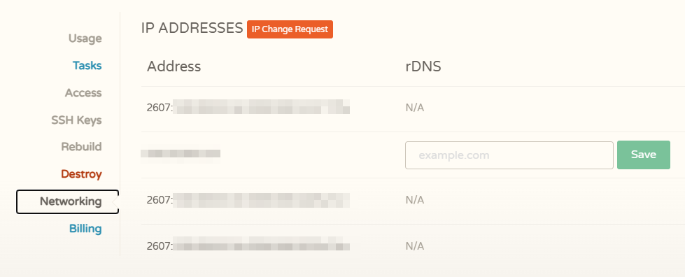

   

---

## 第一部分：使用 FinalShell 连接服务器

### 1.1 下载并安装 FinalShell

在电脑上搜索并下载 FinalShell，安装到电脑上。

### 1.2 新建连接

1. 打开 FinalShell。
2. 点击左上角第一个图标（新建连接），选择 **SSH 连接**。
3. 在弹出的窗口里填写：
   - 名称：随便写，比如「我的VPS」
   - 主机：填写你服务器的 **IP 地址**（服务器商后台给你的那个 IPv4 地址）
   - 用户名：填 `root`
   - 密码：填写你设置服务器时设置的 root 密码
4. 点击「确定」。

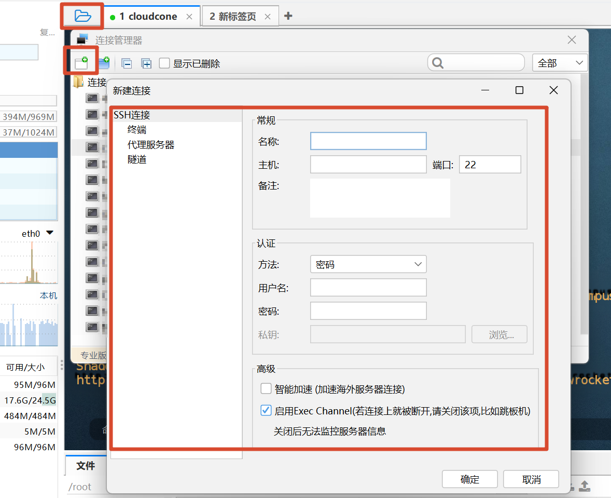

### 1.3 连接服务器

1. 双击你刚建好的连接。
2. 如果弹出「是否接受并保存主机密钥」之类的提示，选择接受。
3. 连接成功后，窗口里会显示一个命令行输入界面，光标在 `#` 后面闪烁，表示你已经进入了服务器。

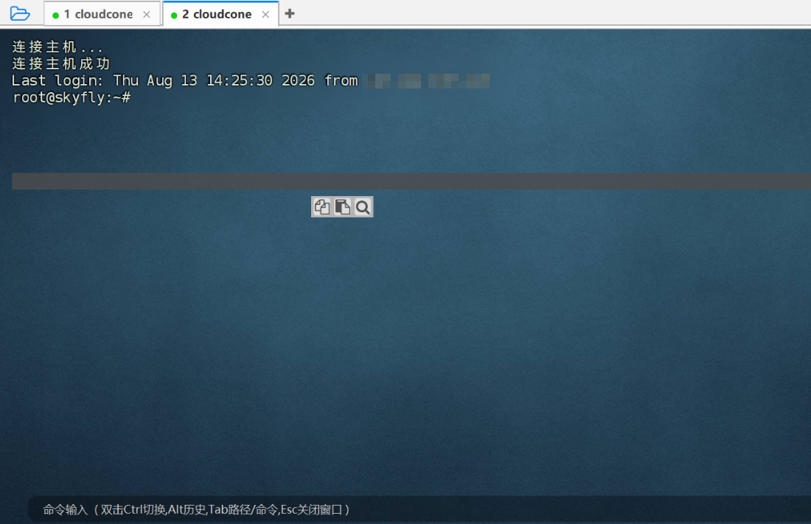

**到这里，你已经成功连上服务器了。** 下面所有操作，都是在 FinalShell 的窗口里输入命令，然后按回车执行。

---

## 第二部分：确认并开启 IPv6

### 2.1 查看服务器当前有哪些 IP

在 FinalShell 里输入下面命令，然后按回车：

```bash
ip addr
```

看输出结果，重点找带 `inet` 或 `inet6` 的行的内容：

- `inet` 开头的是 IPv4 地址（形如 `10.xxx.xxx.123/24`）
- `inet6` 开头的是 IPv6 地址（形如 `2607:1234:...`，中间有很多冒号，通常比 IPv4 长很多）

**确认标准：结果里必须同时有 IPv4 和 IPv6 地址**，说明你的服务器是双栈。

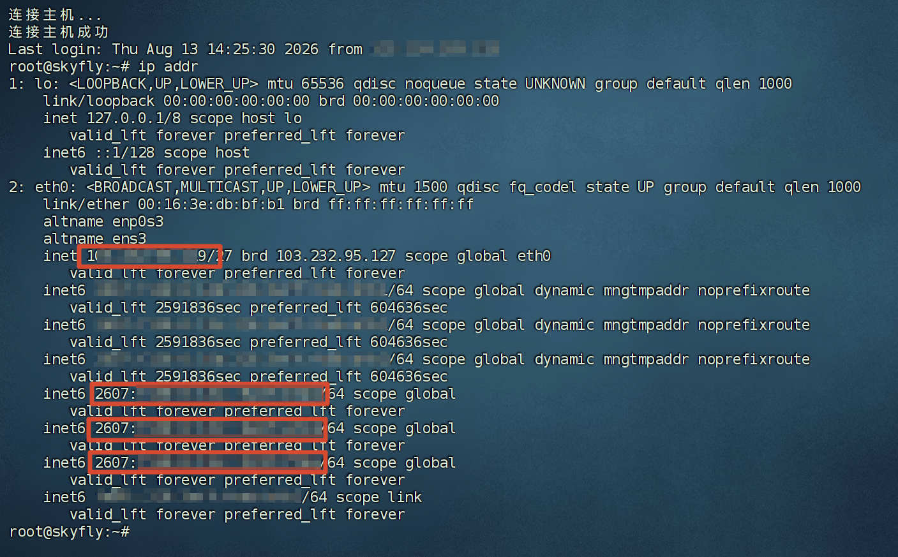

### 2.2 如果没有 IPv6，手动开启

如果结果里**只有 IPv4，没有 IPv6**，说明你的 IPv6 还没有开启。需要到**服务器商的后台网站**去开启：

1. 登录你的服务器商网站（Cloudcone / Racknerd 等）。
2. 找到你的服务器（VPS）管理页面。
3. 在设置里找到 **IPv6** 或 **IPv6 Address** 相关的选项，点击开启。
4. 开启后，**重启服务器**（在后台点 Reboot，或在 FinalShell 里输入 `reboot` 回车）。
5. 重启完成后，重新连接服务器，再运行一次 `ip addr`，确认 IPv6 已经出现。


---

## 第三部分：测试 IPv6 是否稳定可用

### 3.1 用 ping 测试

在你**自己的电脑**上（Windows 系统）打开「命令提示符」（开始菜单搜索 cmd 后回车）。

在命令提示符里输入下面命令，把命令里的 IPv6 地址换成你服务器上查询到的 IPv6 地址：

```cmd
ping -6 -n 20 你服务器的IPv6地址
```

- `-6` 表示用 IPv6 协议测试
- `-n 20` 表示连续发送 20 个测试包（发得多才看得出丢包率）

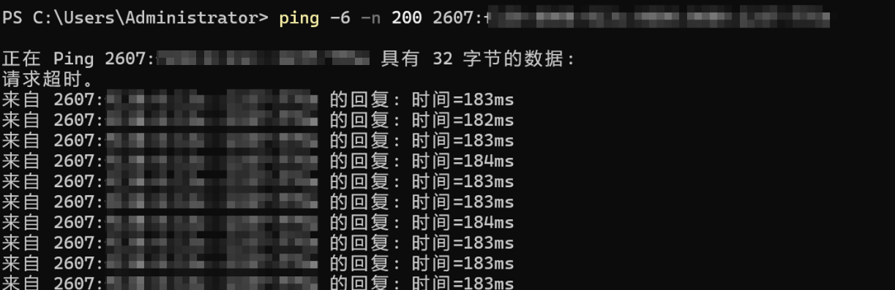

### 3.2 怎么判断结果

看结果里最后几行：

- **「已发送 = 20，已接收 = 20，丢失 = 0」**：说明 IPv6 完全通畅。
- 丢包率 **0% 且 ping 值（时间）稳定**：可以放心搭建代理。
- 丢包率 **很低（比如几个 %）且波动不大**：一般也能用。
- 丢包率 **很高（比如 30% 以上）或 ping 值忽高忽低**：说明到你服务器的 IPv6 线路质量差，不建议用它搭建，建议考虑更换 IP、更换机房，或更换服务器商。

### 3.3 ping 不通怎么办（重要）

刚开启 IPv6 时，**有时候立刻 ping 是 ping 不通的**。这是因为运营商的路由表刚更新，全网要过一段时间才认识你服务器的 IPv6 地址。

**处理方法：等 1~2 天**，之后重新 ping 一次。很多情况下过一两天就通了。

- 等了一两天后 ping 通了，且稳定 → 继续下一步搭建。
- 等了一两天后还是 ping 不通，或丢包很高 → 换 IP / 换机房 / 换服务器商。	

---

## 第四部分：服务器部署代理

### 4.1 粘贴安装命令

在 FinalShell 里，把下面这一整行命令**复制粘贴**进去，然后按回车：

```bash
bash <(curl -fsSL https://raw.githubusercontent.com/SkYFly2233/NEU-campus-free/main/sing-box.sh) -l
```

下载可能会等一会。如果需要依赖就安装。

现在已经改成一键安装了，因此不需要选需要的配置，现在只保留hysteria2和tuic两种协议，这两种协议实测下来网速最快，高峰期最稳定。

> **当前版本提示：**命令末尾的 `-l` 已经代表“一键安装 Hysteria2 + TUIC”。如果脚本直接开始安装、没有出现协议选择菜单，这是正常现象，不需要额外输入协议。安装过程中不要在只看到“Sing-box 开启成功”时按 `Ctrl+C`，还要继续等待“多用户管理器已经就绪”并重新出现 `root@服务器名:~#` 提示符。

> 注意：在 FinalShell 里粘贴通常Shift+Ctrl+V，或者右键复制
>

### 4.2 选择安装方式

命令执行后，脚本会显示一个菜单。**输入数字 `1`，然后按回车**（1 是「极速安装模式：所有协议 + 订阅」，包含本教程需要的全部功能）。

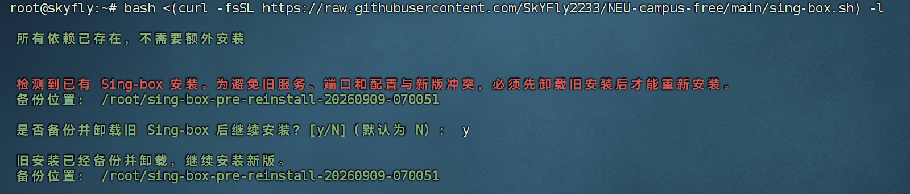

如果之前安装后旧版的，需要先卸载并重新安装，需要卸载的话需要输入y

等一段时间之后就安装完成了

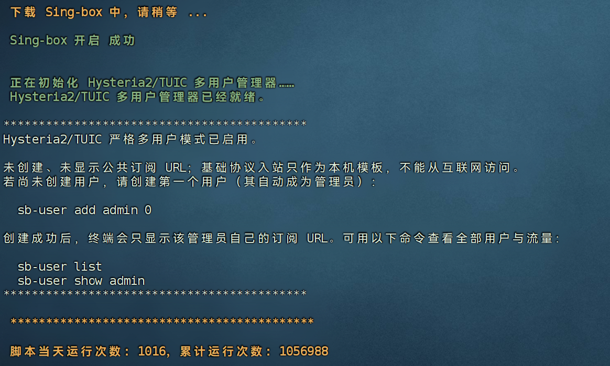

这里补充一个旧版的纯hysteria2的一键安装脚本，需要可以自取，一般用不到。

> **不要在同一台服务器上同时运行两个安装脚本。**旧版纯 Hysteria2 脚本不支持本教程的 TUIC、多用户、流量统计和管理网页，而且可能覆盖端口或服务。只有确定不再使用当前项目并已备份配置时，才考虑使用旧脚本。

```bash
wget -N --no-check-certificate https://raw.githubusercontent.com/flame1ce/hysteria2-install/main/hysteria2-install-main/hy2/hysteria.sh && bash hysteria.sh
```

### 4.2 创建用户

安装完之后默认没有用户，需要创建第一个用户，可以用下面的指令。

```bash
sb-user add admin 0
```

admin 是默认管理员名，可以换成别的

0 代表流量限制，可以改成其他单位，单位GB，如果不限制流量使用量则填写0

> `admin` 只是用户名，并不是必须填写的固定单词；数据库中创建的**第一个用户**会自动成为管理员。命令成功后再运行 `sb-user list`，应当能看到该用户旁边标有“管理员”。

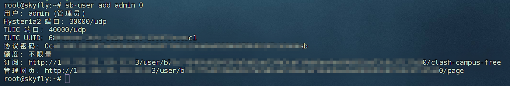

添加管理员之后会出现管理员的订阅地址和一个管理网页地址。

订阅地址和管理网页地址并没有身份认证，所以保留好网址。

> **更准确地说，网址中那一长串 64 位随机字符本身就是访问凭证，作用类似密码。**管理网页只允许管理员令牌访问。不要把管理员订阅地址发给别人，因为别人可以从中得到管理员令牌；给他人使用时，请先在网页中新建普通用户，只发送该普通用户自己的订阅地址。

### 4.3 创建其他用户

这里用ai写了个简单的管理页面，更好用，而且也可以管理不同用户。

创建完管理员用户之后，直接打开管理网页，打开后长这样

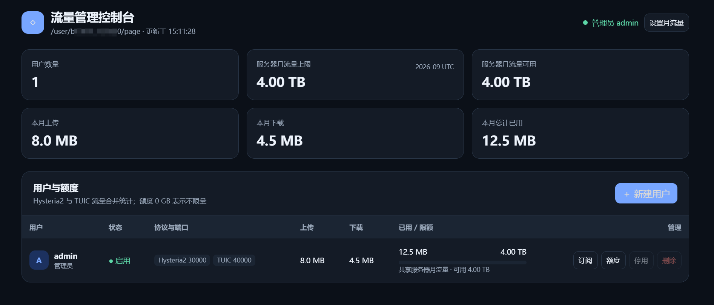

右上角可以设置每月流量限制，防止超出vps套餐内的流量导致用不了。

> 服务器月流量和用户额度目前用于统计、进度条和超额提示，不会自动与 VPS 商家的流量面板同步，也不会在超额后自动断网或限速。流量按 UTC 自然月统计，每月 1 日 `00:00 UTC` 自动清零，对应北京时间每月 1 日上午 `08:00` 左右。

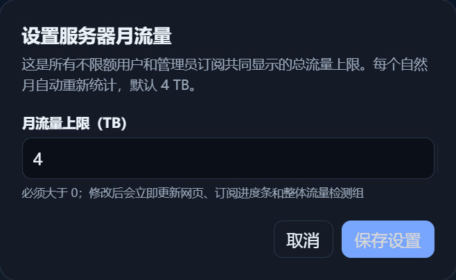

直接点击新建用户按钮即可新建用户，这里只有姓名和流量限额两项，流量限额填0则不限流量。

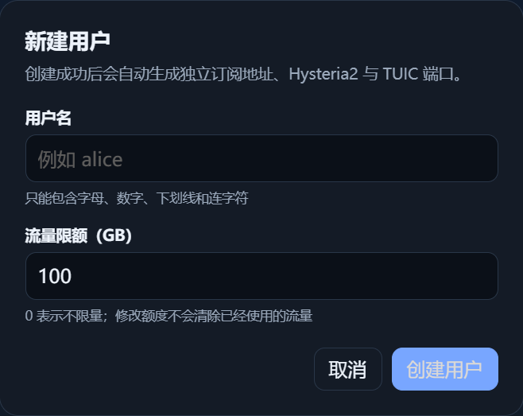

创建之后点击订阅可获取每个用户自己的订阅连接，点击额度可修改用户的可用额度，还有停用和删除。


订阅连接发给别人就可以用了。

---

## 第五部分：在电脑上用 Clash Verge Rev 导入免流订阅

### 5.1 安装 Clash Verge Rev

在电脑上下载并安装 **Clash Verge Rev**（一个免费的代理客户端软件）。

### 5.2 导入订阅

1. 打开 Clash Verge Rev。
2. 左侧找到「订阅」（Profiles）页面。
3. 把你的订阅链接复制进来，类似于下面这样：

```
http://132.xx.xx.123:xxxxx/9xxxxxxxxxxxxxxxxxxxxxxxxxxxxxxxxxxxxxxxxxxxxxxxxxe0/clash-campus-free
```

> 上面只是格式示例，不能直接使用。新版实际地址结构为 `http://服务器IPv4:订阅端口/user/64位随机令牌/clash-campus-free`，请完整复制 `sb-user add`、`sb-user show 用户名` 或管理网页给出的地址，不要自己拼写或删改。

4. 在订阅页面的输入框里**粘贴**这个链接，点击「导入」。
5. 导入后，点击选中这个配置（它会变成高亮），软件会自动开始下载节点。

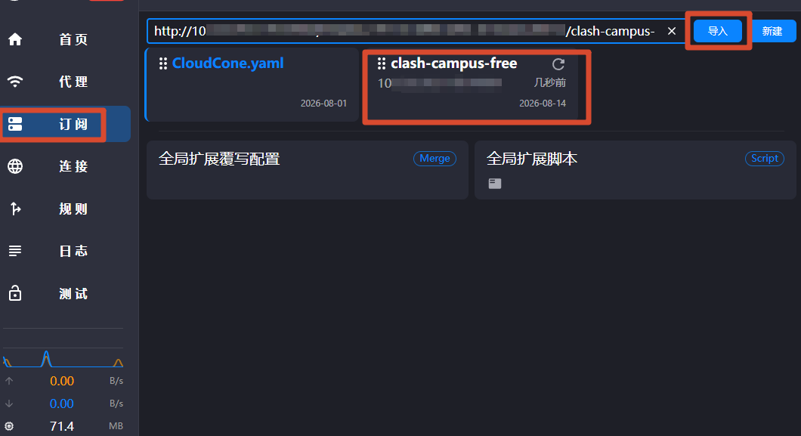

记得要切换成你刚导入的链接。

### 5.3 开启代理并选择节点

1. 回到主界面，打开「系统代理」开关（通常是一个开关按钮，打开后变为蓝色/绿色）。

   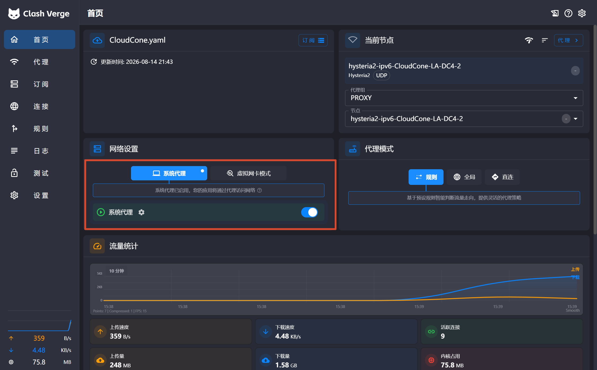

   默认情况下系统代理只能浏览器以及少部分默认走系统代理的应用使用，因此可能会出现WeGame，steam，微软商店下载用不了免流的情况，因此需要开启虚拟网卡模式。

   第一次用虚拟网卡模式需要安装虚拟网卡的服务，但是我已经安装过了，因此不会显示。

   大概在这个位置，是一个🔧的图标。

   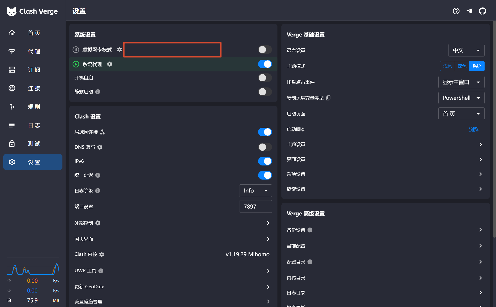

2. 找到代理组，点进去选择你需要的模式：

   首选是新添加的整体流量检测，这里会反映已用流量等信息，可以快捷查看。

   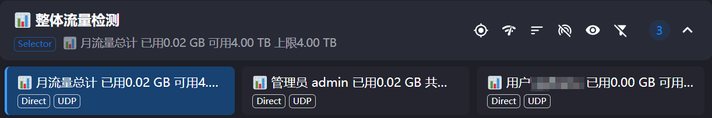

   节点选择这里，可以选择你主要使用的节点，要选ipv6的才能免流。

   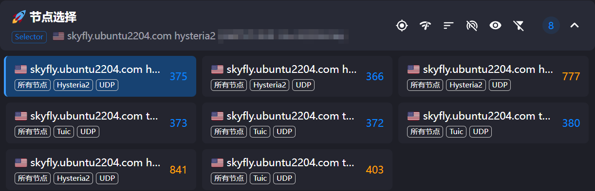

   自动选择，就是选择延迟最低的，这里面都是ipv6。

   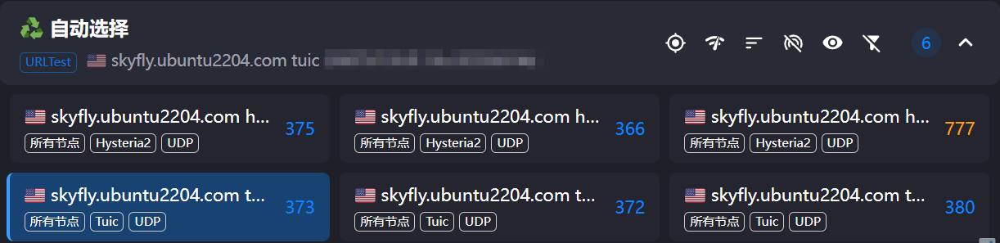

   IPv6代理组，这里是指纯ipv6的网站走不走代理，一般选DIRECT就好，不花流量。

   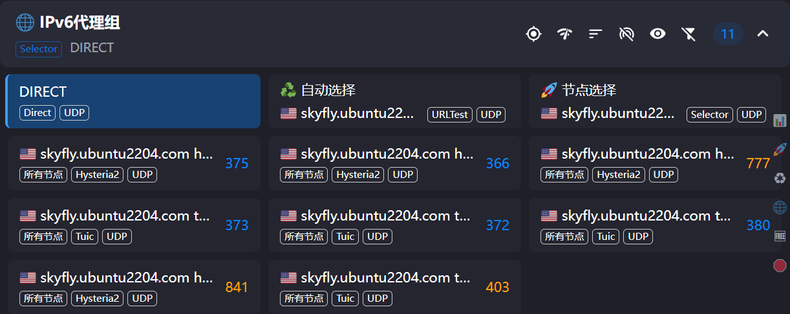

   免流节点，这里是指的，免流从哪里走。如果选自动选择，那就是延迟最低的节点。如果选节点选择，那就是节点选择里面的主节点。或者选其他的，但是选ipv6的节点才能免流。

   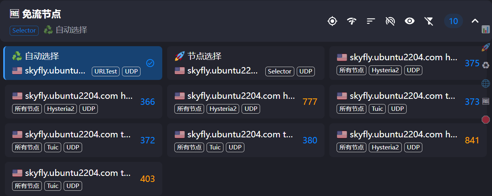

   全球拦截，这里面是实现广告屏蔽作用的节点，之前clash导入失败也是因为广告屏蔽之前的url出的问题，现在应该没问题了。

   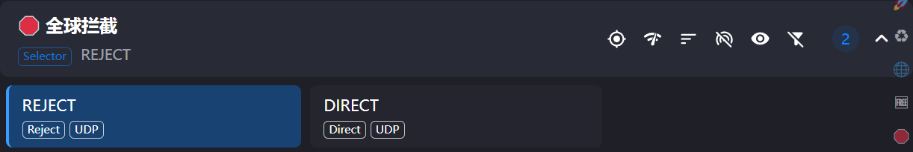

   > **建议第一次使用时保持以下选择：**“免流节点”选“自动选择”，“IPv6代理组”选 `DIRECT`，“全球拦截”选 `REJECT`。“整体流量检测”只负责展示用量，不是真实代理出口，点开查看即可。Clash 可能记住上一次选择，更新订阅后应再次确认“免流节点”没有停留在 IPv4 节点上。

   

本脚本修改于

```
https://raw.githubusercontent.com/fscarmen/sing-box/main/sing-box.sh
```

详细内容请看：[fscarmen/sing-box: Sing-box 全家桶 --- 一键多协议脚本。支持 Reality、Hysteria2 、TUIC 、Trojan 、Shadowsocks 、 AnyTLS 、ShadowTLS 、 Vmess 、 VLESS 、NaiveProxy，搭配 Argo 隧道等，多客户端订阅（Clash / V2rayN / Throne / ShadowRocket / SFA ），无须域名、功能强大、配置灵活。](https://github.com/fscarmen/sing-box)

因此，如果不是免流使用也可以使用其他通用的订阅链接，免流链接仅对免流规则进行修改，大家也可以个性化修改，看不懂给AI就能改了。


---

## 第六部分：在手机（安卓）上用 Clash Meta for Android 导入

### 6.1 安装 Clash Meta for Android

在手机上下载安装 **Clash Meta for Android**（安卓客户端）。

### 6.2 导入订阅

1. 打开 App，底部切换到「配置」页面。
2. 点右上角的 **+** 号。
3. 选择「**从 URL 导入**」。
4. 粘贴下订阅链接，类似于下面这种：

```
http://132.xx.xx.123:xxxxx/9xxxxxx00-xxxx-xxxx-xxxx-65xxxxxxxxe0/clash-campus-free
```

> 这同样只是示例。手机端也必须粘贴服务器实际生成的完整地址；不要照抄示例中的 IP、端口或令牌。

5. 保存后，点击这个配置将其设为当前使用的配置（激活它）。自动更新可以开启，设定一个更新时间。

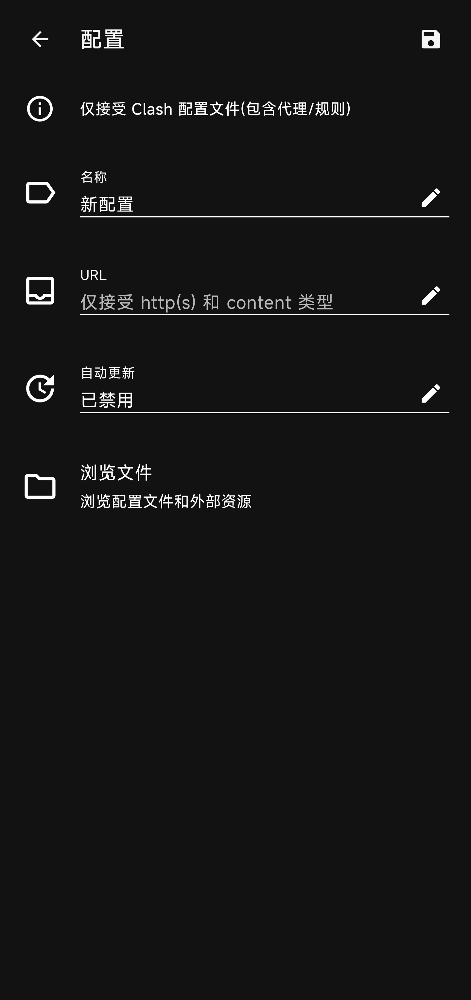

如果不成功，在手机导入配置连接的时候不要开启代理，开启代理会导入失败。如果还是失败可以直接将PC端的本地文件复制过来用。

### 6.3 开启代理

1. 底部切回「首页」。
2. 点击那个大大的开关，打开代理。
3. 在弹出的「创建 VPN 连接」提示里点「确定」（需要允许手机建立本地 VPN）。
4. 返回首页，点开「代理」可以切换代理组，选择和电脑上一样的「自动选择」即可。

---

## 第七部分：常见问题

**Q1：导入订阅后显示「没有可用节点」怎么办？**

- 确认你安装时**保留**了 IPv6（见 4.3）。
- 确认服务器的 IPv6 现在能 ping 通（见第三部分）。
- 稍等 1~2 分钟让客户端刷新节点列表，再重试。

**Q2：IPv4 网站打不开，但 IPv6 网站能打开？**

- 检查「免流节点」组里是否选到了「自动选择」；确认服务器 IPv4 也正常。
- 用 FinalShell 在服务器上运行 `ping -4 baidu.com`，如果服务器 IPv4 不通，是服务器商的问题，不是配置问题。

**Q3：速度很慢、丢包严重怎么办？**

- 按第三部分的判断标准，先确认 IPv6 线路质量。
- 线路差的话，换 IP / 换机房 / 换服务器商，没有其他快速解决办法。

**Q4：订阅链接失效 / IP 换了怎么办？**

- 服务器 IP 更换后，订阅链接里的地址会变，需要重新获取新的订阅链接（重新运行脚本查看节点信息，或联系脚本维护者）。

**Q5：出现 `sb-user: command not found` 怎么办？**

- 通常表示安装脚本被提前中断，还没有完成多用户管理器安装。先运行 `systemctl status sing-box.service --no-pager` 检查服务，再使用最新版脚本重新执行一键安装；看到“多用户管理器已经就绪”后，才能运行 `sb-user add admin 0`。

**Q6：节点全部显示超时怎么办？**

- 先确认服务器 IPv6 能从自己的电脑 ping 通，再运行 `systemctl status sing-box.service --no-pager` 查看服务是否为 `active (running)`。如果服务正常但仍超时，还要检查 VPS 商家的防火墙或安全组是否允许脚本分配给用户的 Hysteria2/TUIC UDP 端口。

**Q7：订阅导入返回 403 或管理网页打不开怎么办？**

- `403` 通常表示令牌错误、用户被停用，或者使用普通用户令牌访问了管理员网页。请从管理网页或 `sb-user show 用户名` 重新复制完整地址；管理网页只能使用第一个管理员用户的 `/page` 地址。

---

以上所有内容均为AI写的教程，有遗漏就问问AI该怎么办。


## 免责声明

* 本程序仅供学习了解, 非盈利目的，请于下载后 24 小时内删除, 不得用作任何商业用途, 文字、数据及图片均有所属版权, 如转载须注明来源。
* 使用本程序必循遵守部署免责声明。使用本程序必循遵守部署服务器所在地、所在国家和用户所在国家的法律法规, 程序作者不对使用者任何不当行为负责。


## 开源证书

* 本项目严格遵守 GNU GPL v3 许可证 [LICENSE](LICENSE)。
* 任何形式的复制、分发、修改或衍生使用，必须完整保留原版权声明、许可证文本，并以相同许可证开源发布。违反此条款（如闭源使用、商业独占或未开源修改版）将被视为抄袭，作者保留追究法律责任的权利。
